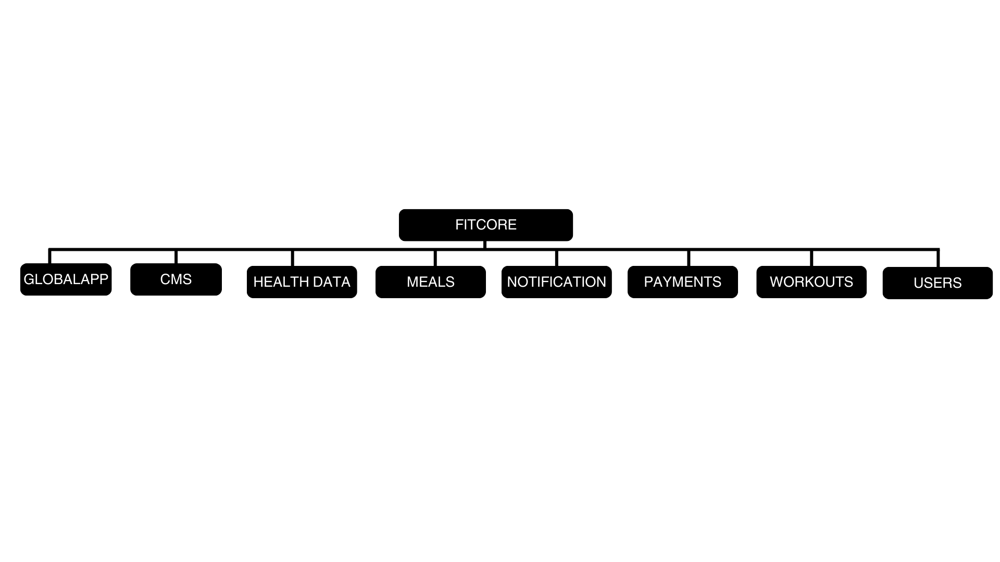

# FitCore – AI-Powered Fitness App 🏋️🤖🥗

FitCore is a cross-platform AI-powered fitness application that empowers users to meet their fitness goals through premium workout videos and personalized AI-generated meal plans. It syncs health data from smart devices like Google Fit and Apple HealthKit or uses manual inputs as a fallback.

---

## 🔗 Live Links

- **🌐 Live App:** [https://fitcore-d38307ecce19.herokuapp.com](https://fitcore-d38307ecce19.herokuapp.com)
- **🛠️ Admin Panel:** [https://fitcore-d38307ecce19.herokuapp.com/admin/](https://fitcore-d38307ecce19.herokuapp.com/admin/)  
  ➤ *Login:* `admin@gmail.com` / `admin`
- **📘 API Documentation (ReDoc):** [https://fitcore-d38307ecce19.herokuapp.com/redoc/](https://fitcore-d38307ecce19.herokuapp.com/redoc/)
- **📒 Swagger UI:** [https://fitcore-d38307ecce19.herokuapp.com/swagger-ui/](https://fitcore-d38307ecce19.herokuapp.com/swagger-ui/)

---

## 🧠 Core Features

- 💡 AI-generated personalized meal plans
- 🎥 Categorized workout video library
- 🔄 Health data sync via Google Fit / Apple HealthKit
- ✍️ Manual health data fallback
- 🛒 Subscriptions and one-time content purchases
- 🔔 Notifications for progress, updates, and new content

---
## Core System Micro Service Base Architecture


## 🗃️ Database Schema

This project uses **PostgreSQL**, with the following database schema:


🧭 View the interactive DB diagram here:  
🔗 [https://dbdiagram.io/d/681376501ca52373f5198603](https://dbdiagram.io/d/681376501ca52373f5198603)

---

## ⚙️ Backend Tech Stack

- **Framework:** Django + Django REST Framework
- **Database:** PostgreSQL
- **Authentication:** JWT & OAuth2
- **Media Storage:** AWS S3 / Cloudinary
- **AI Meal Planning:** OpenAI GPT or custom ML integration
- **Deployment:** Heroku

---

## 🚀 Setup Instructions

```bash
# Clone the repository
git clone https://github.com/iftesamulohy/fitcore-server.git
cd fitcore

# Create and activate virtual environment
python -m venv env
source env/bin/activate  # (use `env\Scripts\activate` on Windows)

# Install dependencies
pip install -r requirements.txt

# Run migrations
python manage.py migrate

# Start the server
python manage.py runserver


> 🛠 **Note:** The project uses a custom `BaseViews` system and a dynamic API function implemented in the `globalapp` module. Thanks to this architecture, building a general-purpose API takes only **10–15 minutes** under normal conditions. However, endpoints involving complex AI logic (like GPT integration or model inference) may take additional time depending on the implementation complexity.
